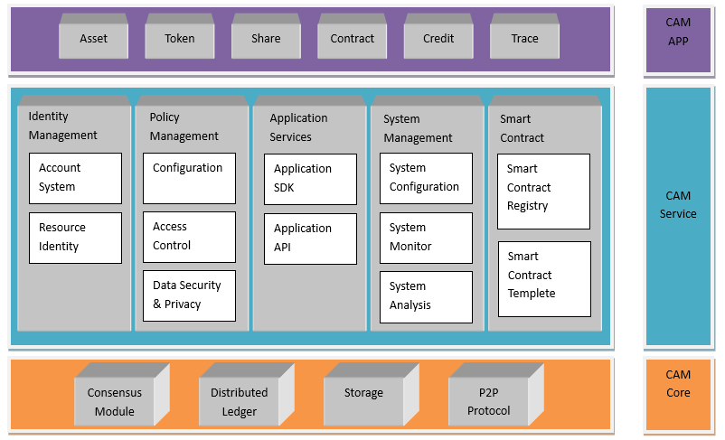

# Cam介绍

## Cam目标

CAM区块链平台的目的在于提供基于区块链技术的商业级系统服务，包括企业级区块链基础平台、区块链与应用业务的中间件连接系统、典型场景的应用系统。

CAM区块链产品在多个行业，不同项目的应用中，经过不断的提升，表现如下特点：

* 快速重构应用：自定义账本结构及业务模型，可快速重构系统以适应不同的应用；
* 海量用户支撑：高效、快速交易验证和同步，支撑亿级用户规模；
* 可视化管理：从网络、系统、业务层面提供可视化的运维管理；
* 隐私权限策略：丰富的权限策略配置，根据应用需求进行隐私保护；
* 智能合约：支持可编程的合约开发，并提供典型场景的合约模板；
* 区块链中间件：为各种不同的应用场景，提供基于区块链技术的服务；

## Cam体系架构

CAM区块链平台可适应不同的应用场景，采样三层系统架构：CAM核心层、CAM服务层、应用层。如下图所示。

  

CAM产品体系架构分为：核心层、服务层、应用层。

* 核心层：共识模型、分布式账本、数据存储、P2P协议；
* 服务层：数字身份管理、策略管理、应用服务、系统管理、智能合约；
* 应用层：数字资产发行、贸易金融、供应链溯源、个人信用登记、公示公证、联合征信；

## 共识模型

共识模块：采用DBFT共识机制，DBFT 全称为Delegated Byzantine Fault Tolerant，是一种大规模节点参与共识的拜占庭容错型共识机制。CAM的多个创建者成为记账人，CAM代股的持有者可申请记账资格。随后由记账人团体通过 DBFT 算法，来达成共识并生成新的区块。

DBFT 对由N个共识节点组成的共识系统，提供F=(N-1)/3 的容错能力，容错参数可通过配置文件修改，这种容错能力同时包含安全性和可用性，可以抵抗恶意节点攻击和拜占庭故障，并适用于任何网络环境。DBFT 具有良好的最终性，一个确认即最终确认，区块无法被分叉，交易也不会发生撤销或回滚。

在 CAM 的 DBFT 共识机制下，每 10~15 秒生成一个区块，交易吞吐量实测可达到约 1000tps，在公有链中性能优秀。通过适当优化，有能力到达 10000TPS，可以支持大规模的商业化应用。

## 智能合约

智能合约是 1994 年由密码学家尼克萨博（Nick Szabo）最先提出的理念，几乎与互联网同龄。根据 Nick Szabo 的定义：当一个预先编好的条件被触发时，智能合约执行相应的合同条款。区块链技术给我们带来了一个去中心化的，不可篡改的，高可靠性的系统，在这种环境下，智能合约才大有用武之地。CAM 具备独立的智能合约体系：CAMContract。

CAMContract 智能合约体系的最大特点是无缝对接现有的开发者生态。开发者无需学习新的编程语言，就能用 C#、Java 等主流编程语言在熟悉的 IDE 环境（Visual Studio、Eclipse 等）中进行智能合约的开发、调试、编译。CAM 的通用轻量级虚拟机 CAMVM 具有高确定性、高并发性、高扩展性等优点。CAMContract 智能合约体系让全球百万级的开发者能够快速进行智能合约的开发。

## 数字身份

数字身份是指以电子数据形式存在的个人、组织、事物的身份信息。目前较为成熟的数字身份体系是基于 PKI（Public Key Infrastructure）的 X.509 标准。在 CAM 中，我们将实现一套兼容 X.509 的数字身份标准。这套数字身份标准，除了兼容 X.509 的层级式的证书签发模式，还将支持 Web Of Trust 式的点对点的证书签发模式。

## 应用对接

CAM应用对接包括数字身份管理、策略管理、应用接口服务、系统管理组成。为适应不同的应用的需求，需要基于底层区块链的基础服务。

数字身份管理：在区块链技术自有的公私钥体系下，身份管理负责：公私钥生成，公钥写入，私钥签名与管理；保存应用层用户信息与区块链地址映射关系；支持实名认证及审计监管需求。

策略管理：CAM区块链平台提供策略管理，即可以管理维护区块链系统本身的配置和安全，也可以管理区块链存储数据的访问策略和隐私安全。

应用服务：为基于CAM区块链技术的开发者社区提供SDK开发套件，同时提供API接口配合不同的应用操作CAM系统。

系统管理：配置管理服务主要提供的配置操作，针对安全、策略、权限、区块链节点、共识算法参数、系统参数进行配置；配置本身也作为区块链的事务类型，由节点共同投票确定生效。组网安全方面采用安全措施包括IP控制、专线、节点授权才能接入、节点信任列表等。CAM的区块链健康监控平台提供多层监控：物理层（CPU、内存、磁盘等）、网络层（时延、断线）和业务层（区块生成、交易验证）；并提供完善的告警、日志、消息通知机制体系，便于商用系统的运维。系统分析提供了分布式账本内存储的大量原始数据的查询接口，以满足应用层各种数据分析需求。

## 系统性能

### 性能方面

* 快速交易验证
* 海量数据存储
* 高吞吐量
* 节点数据快速同步

### 扩展性方面
*	多业务兼容
*	权限控制策略
### 安全方面：
*	安全公私钥管理
*	多重隐私保护机制
### 运维方面：
*	全平台部署
*	可视化运维

