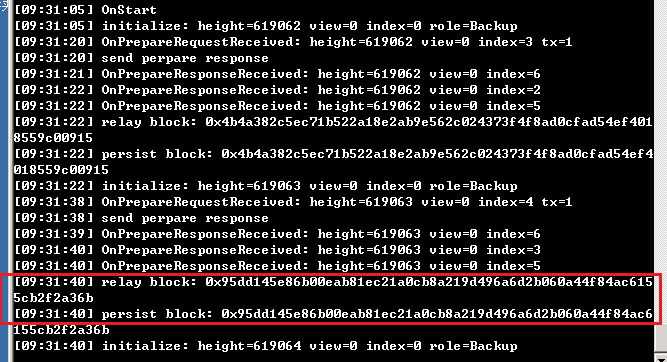
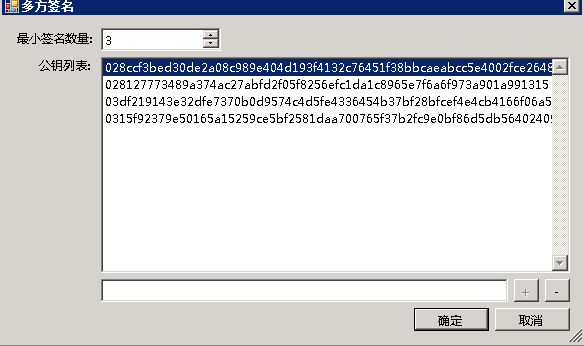
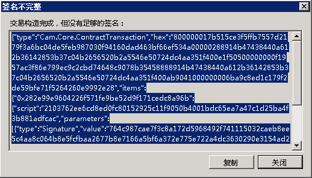
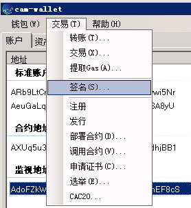
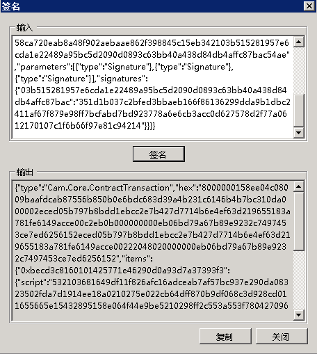
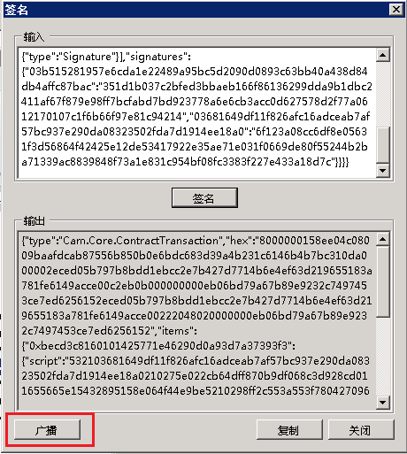

# 用 Cam 节点搭建私有链

阅读完 [Cam 节点的安装部署](../node/servermanual.html) 后，我们已经可以在 Windows 和 Linux 上部署 Cam 节点了，本篇教程会教你如何用 Cam 节点搭建私有链，并且如何从自己的私有链中提取 Cam 和 Gas。                        

Cam 私有链的部署至少需要 4 台服务器才能取得共识，每台服务器对应一个共识节点，每台服务器上有一个 Cam 钱包文件。

## 1、配置虚拟机

Cam 私有链的部署至少需要 4 台服务器才能取得共识，每台服务器对应一个共识节点。为了演示，我在windows8及以上系统自带的 Hyper-V 上创建了 4 台 Windows 虚拟机，大小为  (1 核心，2 GB 内存)。

创建好后，要开通 18331-18334 端口，具体方法为在系统的 `防火墙` `高级设置` `入站规则` 中新建规则，然后添加端口 18331-18334。

> [!Note]
> 如果你在云服务器上创建的虚拟机，还要登录虚拟机的管理后台，设置网络安全组

创建好虚拟机后，将四台虚拟机的 IP 地址保存下来以备后用。

## 2、安装 Cam 节点

Cam 节点的安装过程上文已经详细介绍过了，安装过程请参考 [Cam 节点的安装部署](../node/servermanual.html)。 

## 3、创建钱包

我们首先创建 4 个钱包文件，依次为 wallet1.json - wallet4.json，这一步在 PC 版钱包和命令行钱包都可以创建。

创建好钱包后将 4 个钱包的公钥保存下来（保存到一个 txt 文件中即可）以备后用。直接复制上面的公钥或者用 [CLI 命令](../node/console.html) 中的 `list key` 命令查看公钥再复制均可。

然后将 4 个钱包分别复制到 4 个虚拟机的节点目录下。

## 4、修改节点的配置文件

打开节点的配置文件 `protocol.json` 。

首先修改 `Magic` 值，Magic 用于识别消息的来源网络，指定不同的 Magic 确保 Cam 区块链中的不同网络信息在传输过程中不会发送到其它网络。 

> [!Note]
> Magic 的类型为 uint，所以注意所填写的数值要在 [0 - 4294967295] 区间内。

然后修改 `StandbyValidators`，将第三步记下来的 4 个公钥填写在这里。

最后修改 `SeedList`，将第一步记下来的 IP 地址填写在这里，端口号保持不变，例如我修改成下面的配置。

```json
{
  "ProtocolConfiguration": {
    "Magic": 822930536,
    "AddressVersion": 23,
    "StandbyValidators": [  
      "03681649df11f826afc16adceab7af57bc937e290da08323502fda7d1914ee18a0",
      "0275e022cb64dff870b9df068c3d928cd011655665e15432895158e064f44e9be5",
      "0298ff2c553a553f78042709658ca720eab8a48f902aebaae862f398845c15eb34",
      "03b515281957e6cda1e22489a95bc5d2090d0893c63bb40a438d84db4affc87bac"
    ],
    "SeedList": [
      "192.168.10.120:18333",
      "192.168.10.121:18333",
      "192.168.10.122:18333",
      "192.168.10.123:18333",
    ],
    "SystemFee": {
      "EnrollmentTransaction": 1000,
      "IssueTransaction": 500,
      "PublishTransaction": 500,
      "RegisterTransaction": 10000
    }
  }
}
```

SystemFee 是系统手续费，目前手续费如下（单位为 GAS）：

记账人报名 1000 分发资产 500 智能合约发布 500 注册资产 10000

可以在这里设置私有链中的系统手续费。

最后将修改过的 protocol.json 复制到 4 个节点的客户端目录下，替换之前的 protocol.json 的文件。

然后在 4 台虚拟机上依次输入以下命令启动节点，打开钱包，开启共识。不记得命令的请参考 [CLI 命令参考](../node/console.html)。 

启动节点：

`dotnet cam-server.dll`

打开钱包：

`open wallet wallet1.json` 

注：这里并非所有节点都要打开 wallet1 钱包，每个节点应该打开自己的钱包文件,例如192.168.10.120打开wallet1.json、192.168.10.121打开wallet2.json，依此类推。

然后在命令行中输入开启共识命令，如果未开启共识命令，将会导致后续的开启钱包客户端无法增长区块高度。

`start consensus`

如果上述操作成功，可以运行show state来查看节点状态。若高度发生变化，则说明共识过程正常。4个节点的共识过程如图所示



注：出现 `realay block` 关键字说明区块正常生成。

## 5、提取 Cam、Gas

安装 PC 版客户端（cam-wallet），修改配置文件 protocol.json 使其连接到私有链中。

打开钱包，如果左下角有连接数不为零，而且一直在同步区块，表示该客户端已经成功地连接到了私有链中。

在 PC 版客户端中打开钱包 wallet1.json，添加多方签名地址，输入 protocol.json 中的 4 个公钥，设置最小签名数量为 3（共识节点数量 / 2 + 1），如图所示。



确定，然后需要重建钱包索引，在菜单栏中点击 `钱包` `重建钱包索引` 然后你就会看到在合约地址中有 2 亿的 Cam 了。

> [!Note]
>  4 个钱包都要执行这个操作：添加多方签名地址，重建钱包索引

下面我们要将该 Cam 从合约地址转到普通地址中，打开 4 个钱包中的任意一个，点击 `交易` `转账` 输入一个标准地址，将 2 亿 Cam 转到这个地址中。

然后系统会提示“交易构造完成，但没有足够的签名”，然后将代码复制下来。



打开第二个钱包，点击 `交易` `签名` 粘贴刚才复制的代码，点击 `签名`





然后将代码复制下来，打开第三个钱包，点击 `交易` `签名` 粘贴刚才复制的代码，点击 `签名`， 这时你会发现窗口中出现了一个 `广播` 按钮，代表交易已经签名完成（达到多方签名合约要求的最少签名数量）可以广播，点击 `广播` 后转账交易开始广播，约 15 秒后转账成功。



提取 Gas 的操作方法也类似，点击 `高级` `提取 Gas` `提取` ，（记得这时所在的钱包 X，下文会用到），如图所示

接下来的操作与转账 Cam 类似，将没有足够的签名的代码复制下来，打开第二个钱包，点击 `交易` `签名` 粘贴刚才复制的代码，点击 `签名`， 然后将代码复制下来，打开第三个钱包，点击 `交易` `签名` 粘贴刚才复制的代码，点击 `签名`，点击 `广播` 后提取 Gas 的交易开始广播，约 15 秒后提取成功。

提取成功后 Gas 会进入到你发起提取 Gas 的交易所在的钱包（即上方的 X 钱包）的第一个标准地址.

