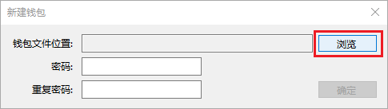
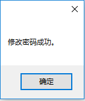

# cam-wallet安装使用说明

## 前言
全节点是存储 CAM 区块链全部数据的节点，通过 P2P 的方式与区块链网络连接，在区块链网络中，所有的全节点都是平等的，既充当客户端又充当服务器。

CAM 有两个全节点程序，一个是给普通用户使用的，有图形界面的，具有除共识外的所有功能的客户端，我们叫它 cam-wallet。

另一个是给开发者用来使用的，命令行界面的，具有一些钱包操作的基本功能，除此之外还会对外提供 API，还可以与其它节点达成共识，参与区块的生成，我们叫它 cam-server。

## 1 cam-wallet安装说明

### 1.1运行环境

#### 1.1.2支持软件

操作系统： Windows 7 SP1 / Windows 8.1 / Windows 10。

系统需要安装 [.NET Framework 4.7.1](https://www.microsoft.com/net/download)

### 1.2软件安装

客户端无需安装，进入客户端下载页面，下载后直接运行cam-wallet.exe即可使用。使用过程中，如遇到任何问题导致客户端无法正常使用，请保留好客户端目录下的 error.log 文件，并与我们的技术人员联系。

## 2 cam-wallet软件使用说明

### 2.1程序启动

点击程序文件目录图标“cam-wallet.exe”，即可启动cam-wallet系统主界面。如下图所示。

### 2.2查看同步信息

程序主界面同步信息如下图所示。

 
客户端运行时会自动同步区块链中的数据，完成区块链同步后，才可使用钱包进行转账及其他操作，但不影响钱包的创建。

左下角的状态栏，“高度”旁边“0/3639/3639”三个数据依次为：钱包高度/客户端本地区块高度/共识服务器节点区块高度，当客户端本地区块高度等于共识服务器节点区块高度，即可确认同步完成，当创建或者打开一个钱包后，钱包高度会自动增长，更新钱包对应当前区块的资产信息以及交易信息。

连接数表示当前连接的节点个数，客户端与这些节点通讯并同步区块数据。

### 2.3钱包管理

#### 2.3.1创建钱包

 

单击菜单栏“钱包”，出现弹出菜单，单击“创建钱包数据库(N)…”。

 

出现新建钱包窗口，单击“浏览”按钮。

 

出现文件夹选择窗口，选择需要保存钱包的文件夹，并为钱包文件命名，单击“保存”按钮。

 

输入密码、重复密码，两次输入需保持一致，然后单击“确定”。

 

回到主界面，钱包创建完成，创建钱包的同时也创建了关联的账户信息。

账户信息包括：地址、地址所属合约类型、私钥、公钥
地址：相当于银行账户，用于转账、交易时接收资产。

地址所属合约类型：单签名合约类型，根据一个公钥生成，是一个1-of-1多重签名，在使用该地址交易时可直接交易。多签名合约类型表示该地址由多个公钥共同生成，是一个m-of-n的多重签名地址，在使用该地址交易时，需要多方签名交易才能完成。

私钥：一个 256 位的随机数，由用户保管且不对外公开，是用户账户使用权以及账户内资产所有权的证明，在交易时，用于对交易信息进行签名，在服务器节点接收交易信息时，使用公钥对信息及签名进行验证，验证成功，交易才生效。

公钥：每一个私钥都有一个与之相匹配的公钥，用于验证钱包发送的消息。

#### 2.3.2打开钱包

在主界面，单击“钱包(W)”菜单，弹出菜单。

 

单击“打开钱包数据库(O)…”，弹出钱包选择窗口。

 

在打开钱包窗口，单击“浏览”按钮。

 

选择钱包文件后，单击“打开(O)”按钮，回到打开钱包窗口。

 

输入创建钱包时设置的密码，单击“确定”，打开钱包成功，回到主界面。

 

#### 2.3.3 修改钱包密码

打开钱包后可以修改密码，单击“钱包(W)”菜单栏，弹出菜单。

 

单击“修改密码(C)…”，弹出修改密码窗口。

 

输入旧密码、新密码、重复密码，新密码与重复密码应一致，单击“确定”按钮，出现如下窗口。

 

提示密码修改成功，单击“确定”按钮，回到主界面。修改钱包密码后，应重新备份钱包，之前备份的钱包密码并未修改，建议删除之前的备份钱包，重新备份。

#### 2.3.4重建钱包索引

该选项用于恢复出现异常时客户端内有误的数据。在以下情况下可能需要重建钱包索引：某笔交易长时间未确认钱包内资产显示错误，与区块链数据不符在测试网和主网之间进行切换时在区块高度较高时，重建钱包索引需较长时间，请耐心等待。

 

### 2.4交易

#### 2.4.1转账

CAM、Gas等资产转账。

 

单击“转账(T)…”按钮，弹出转账窗口。

 

单击“+”按钮，弹出支付添加窗口。

 

选择资产名称，这里我们以CAM为例，选中资产后，系统自动计算当前资产余额，输入对方的账户，然后选择需要转账的数额，单击“确定”按钮。如需在此次交易中还需转给其他账户，可继续单击“+”按钮，添加支付信息。

 

单击“高级”按钮，进入转账的高级设置，一般情况下默认即可，其中手续费只有在系统中存在海量交易需要处理，而用户需要优先处理交易时，则可以增加手续费，手续费越多，系统处理优先级越高。找零地址是当使用的支付代币地址金额大于所需支付的金额时，需要用自己的账户接收这些零钱，当钱包中有多个账户时可单击下拉框选择。

 

单击上图中红框中的按钮，可添加备注信息，单击后弹出备注信息添加窗口。

 

输入备注信息后，单击确定。

 

单击“确定”按钮，则交易发送。

 

交易发送成功，单击“关闭”按钮，关闭窗口。交易发送到共识服务器节点后，需要多方共识并验证该交易后，交易才真正完成，可在交易记录面板查看确认数。当确认数大于0时，说明交易完成。

 

单击“交易记录”按钮。

 

根据交易编号查看确认数，上图中确认数为9，大于0，说明共识服务器节点已经认可了该交易，并记录在区块链中。

### 2.5创建合约

#### 2.5.1锁仓合约

锁仓合约根据账户公钥以及时间创建，转入的账户需要到时间才能转账交易。

 

鼠标单击右键，出现菜单，创建合约地址-》锁仓，单击“锁仓(L)…”。

 

选择绑定账户，解锁日期（只有到此日期才可转出里面的资产），单击创建按钮。

 

#### 2.5.2查看锁仓合约

鼠标右键选择刚创建的锁仓合约。

 

单击“查看合约”。

 

单击“OPCODE”。

 

lock contract为锁仓合约类型，lock time为锁仓时间，确认时间正确，即可转入资产。

#### 2.5.3验证锁仓合约

发送合约脚本十六进制字符串以及地址，让第三方验证。

 

 
### 2.6 注册资产

首先要打开钱包文件，账户需要有至少10000gas才可注册资产。

 

点击菜单栏交易-》注册，弹出窗口。

 

资产种类：share是数字资产的一种，强制精度为0，一般发行类型为Token

名称：英文字母简称，

总量限制：一般要进行限制，如果不做限制，可以发行无限数量的数字资产，需要发行多少的数字资产，则填写多少

精度：根据需要进行设置，发行资产需要精确到小数点后多少位

发行者：选择自己账户即可，

管理员：选择自己的标准账户

分发：选择自己的标准账户

单击确定。
 

单击“试运行”,即可显示合约试运行结果，以及手续费需要多少，目前对所有的交易都有10gas的优惠，也就是10000-10位9990gas的手续费。

单击“调用”，即发送注册资产交易到区块链中。

### 2.7发行资产

选择菜单栏

 

选择交易-》发行。

 

在弹出界面中输入资产ID，注意这是注册资产的交易id，需去掉头部的0x。输入id后，即可查看资产详情。单击+按钮，进行资产发行，一般一次性发放到自己的账户中再进行其他账户的分发。

 

单击“确定”。

 

单击“确定”。

等待交易完成。即可在资产页面查看资产余额。

 

